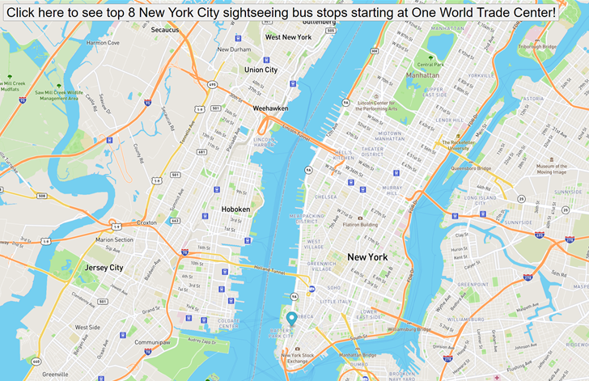

# New York City Sightseeing Bus Stops
## Description
MIT xPro® Professional Certificate in Coding Boot Camp Project: Real Time Bus Tracker. This repo is refactored from the boot camp realt time bus tracking project to show popular sightseeing bus stops around New York City.

## Installation
mapboxgl: JavaScript (JS) Library that is part of the mapbox ecosystem. 

## Usage
This project demonstrated how to work with the document Object Model (DOM) to add animation to maps. Go to mapbox.com to obtain a free Application Programming Interface (API) key to test out mapbox. Mapbox is an open-source platform which allows developers to create and display (a limited number of times) maps on a web page. Using the mapboxgl JS libary, developers can add customizations to their maps such as markers as in the case of this boot camp project.

## Support
Go to: https://docs.mapbox.com/mapbox-gl-js/api/ for documentation.
Go to: https://new.mta.info/developers for more developer resources including new, public APIs.
Google: Longitude, Latitudes (Note mapboxg1 standard is lng, lat)

## Roadmap
This project was completed within the first 4 weeks of the intensive boot camp as is required to be presented as a part of student boot camp portfolio. It is anticipated, and provided time is available, that this project will be improved upon as skill sets progress through the boot camp.  

